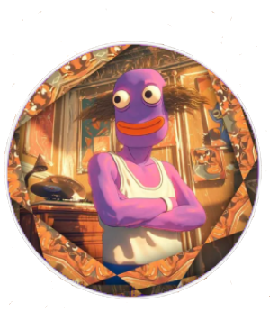
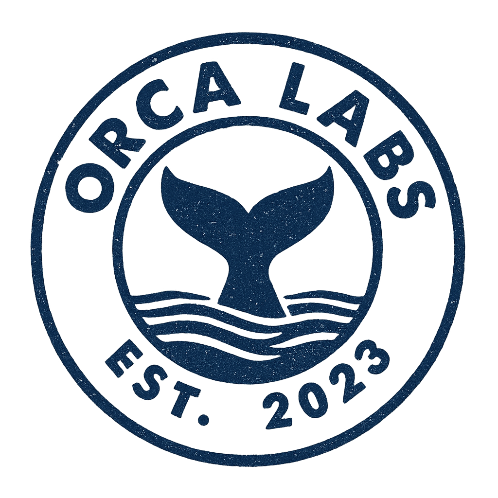

  
  Hello, my name is DANZO, nice to meet you!

I've engineered a first-of-its-kind system on Cardano, combining memecoins and finance — The MemeFI Standard.

It's hard to fit everything into these docs, and even if I did, you probably wouldn't want to read it all in plain text. That's why I'll always be around on our Discord server to help you understand more.

Everything has been built with zero external funding and is entirely developed and supervised in-house by Orca Labs — a professional software delivery company on Cardano.

I present to you: The DANZO Protocol.

