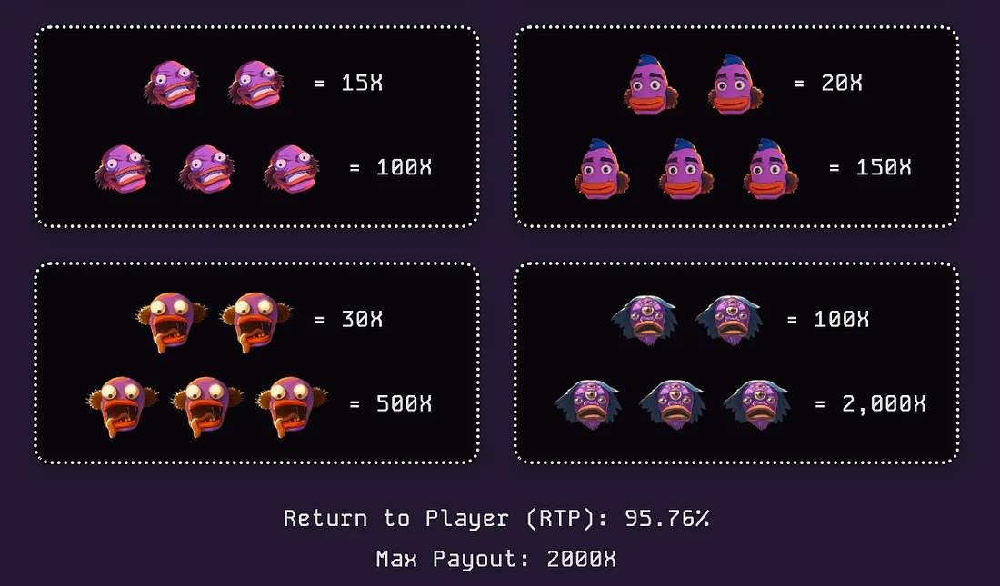

# The Casino

**[Play Casino Games now](https://danzo.gg/#/games)**

Experience the thrill of the game!

Welcome to DANZO Casino, the ultimate gambling hub where 100% of profits are burned, making DANZO deflationary. In this article, we'll explore the casino's current features, along with the rules and odds of each game.

## GAMES

### BONANZA

Bonanza is the traditional Slots game we all love but with a DANZO theme and music!

Bonanza offers a 95.76% RTP (Return to Player) with a maximum payout of x2000 on a single spin! The RTP represents the expected return to the player after 1 million spins. First, we calculate the theoretical RTP, and after conducting numerous simulations with 1 million spins, we fine-tune the final figure. Traditional online slots typically have an RTP of 95–98%, so Bonanza is definitely player-friendly in comparison. Here are the detailed odds:

### CRASH

Crash is the most popular and most played game. It gives you the full experience of trading a shitcoin in just a few seconds — no need for buyers to pump the number up, and no need for exit liquidity to cash in your profits!

The concept is simple: the number goes up until it crashes. If you manage to cash out before the crash, you earn profits equal to your bet multiplied by the current multiplier at the time of your exit.

**ODDS:**

Odds are calculated with the following formula:

Adding the house edge we get a 96% RTP with a maximum return of x5000.

### BLACKJACK

BLACKJACK is the most popular table game to the Casino! We've crafted the best rules to ensure you have the most fun. It's a continuously shuffled 6 deck game!

The full list of rules can be found in-game at all times.

### ROULETTE

Master the classic European roulette by predicting where the ball will land and winning accordingly.

**Key statistics**

The game offers a return to player of 97.3 percent, giving the house an edge of 2.7 percent. The wheel contains thirty‑seven pockets numbered from zero to thirty‑six.

**How the game works**

Roulette follows the traditional single‑zero European format. You place a wager on the pocket where a small ball will come to rest after the wheel is spun. The wheel's thirty‑seven pockets alternate between purple and black, except for the single zero, which is neutral and counted as neither even nor odd. If the ball lands in the pocket you predicted, you receive a payout based on the bet type you selected.

### PLINKO

Plinko is a fast‑paced game of chance in which you drop a ball from the top of a pegboard. As the ball bounces off pegs, it randomly shifts left or right until it reaches one of the pockets at the bottom. The pocket's multiplier is applied to your stake to determine your payout.

**Risk levels**

Before each round you choose a risk level: Easy, Medium, or Hard.

- **Easy** offers the narrowest payout spread, topping out at roughly five‑and‑a‑half times your bet.
- **Medium** widens the range, with a potential thirty‑three‑times return.
- **Hard** introduces extreme volatility—returns can be as high as one‑thousand times the stake or as low as a small fraction of it.

**Bet amount**

Set your wager with the plus and minus controls. The current stake is displayed in ADA. You may adjust the amount before every ball drop.

**Auto‑bet option**

If you prefer continuous play, enable Auto Bet. The game will automatically place and drop consecutive bets using your chosen settings until you disable the feature or your balance runs out.

---

Always play responsibly with the goal of having fun!

Don't forget, everything is accessible via mobile as long as you visit the DANZO APP using your wallet's browser!

**SEE YOU AT THE LEADERBOARDS!**

