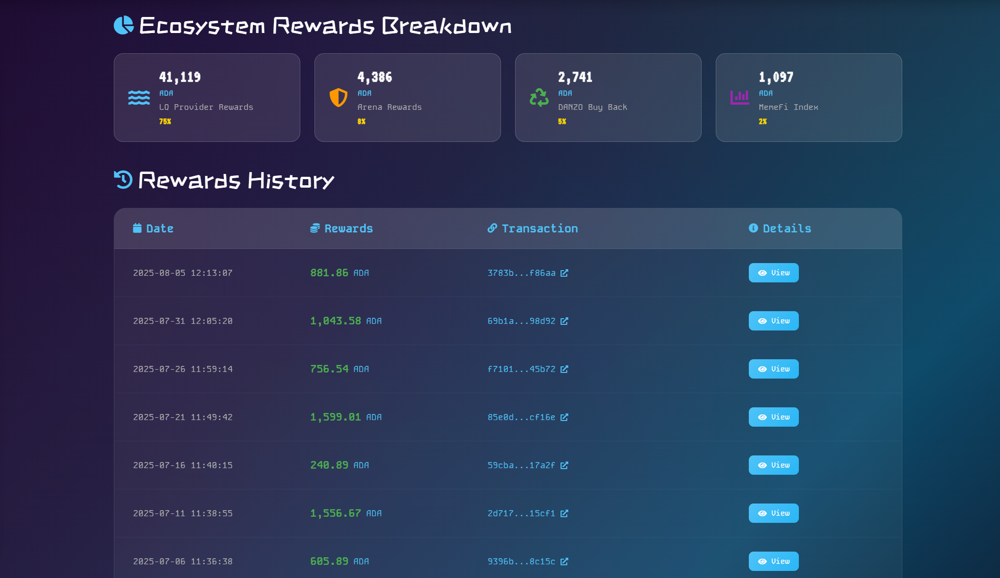
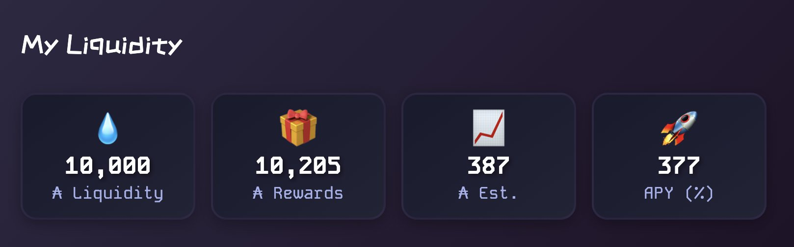

# Becoming the House

## Danzo V4: Pooled-liquidity Gambling on Cardano

Traditional casinos keep the entire bankroll under their own control, so only the operator earns the house edge. Danzo V4 overturns that model by introducing the first Web3 casino on the Cardano blockchain where everyday users can supply the bankroll and share in the returns.

## Instructional Video

[🎥 Watch Instructional Video](https://www.youtube.com/watch?v=gsM-Kblie_8)

Learn how to become a liquidity provider and earn returns by "becoming the house" in this comprehensive video tutorial.

**[Provide Liquidity now](https://danzo.gg/liquidity)**

## How the pooled approach works

Any wallet that holds at least 690 million HodlDANZO tokens can deposit funds into the casino's liquidity pool. Because hundreds or even thousands of token-holders can participate, the total liquidity grows far beyond what a single operator could provide. Larger liquidity means higher maximum bet limits and a more stable house balance.

## Profit-sharing mechanism

After each gaming cycle the casino deducts a predefined fee from the net profits. The operator's revenue is preserved, but the remaining profit is distributed proportionally to every liquidity provider. Instead of one entity monopolising the earnings, the system pays rewards to the entire contributor base.

Rewards are transparent and paid out as an airdrop every 5 days to the liquidity providers.

## Network effects and marketing

When many users participate as liquidity providers they become personally invested in the platform's success. Each provider naturally promotes the casino within their own circles, creating a word-of-mouth marketing engine that reduces or eliminates the need for a traditional advertising budget.

## Why it matters

Danzo V4 aligns incentives between the team and the community, expands the available bankroll, and opens the benefits of "being the house" to anyone who meets the token threshold. The result is a more inclusive, resilient, and self-sustaining gaming ecosystem on Cardano.

Within a few months many people have achieved over 100% APR making this one of the best if not the best yield generating for ADA right now on Cardano.

